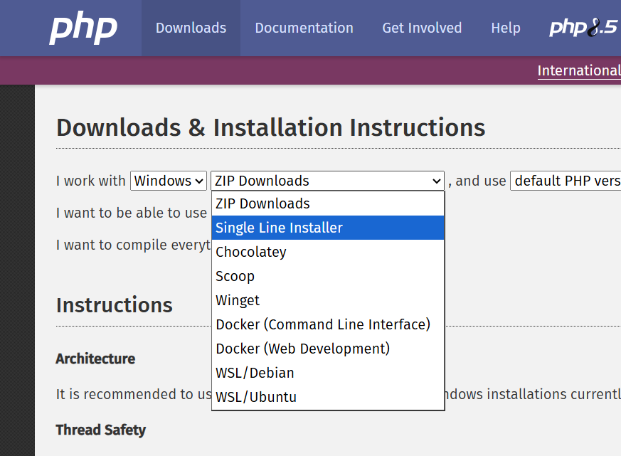
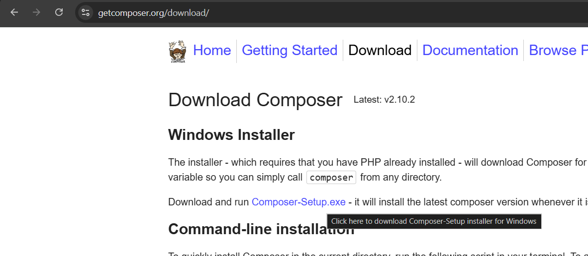
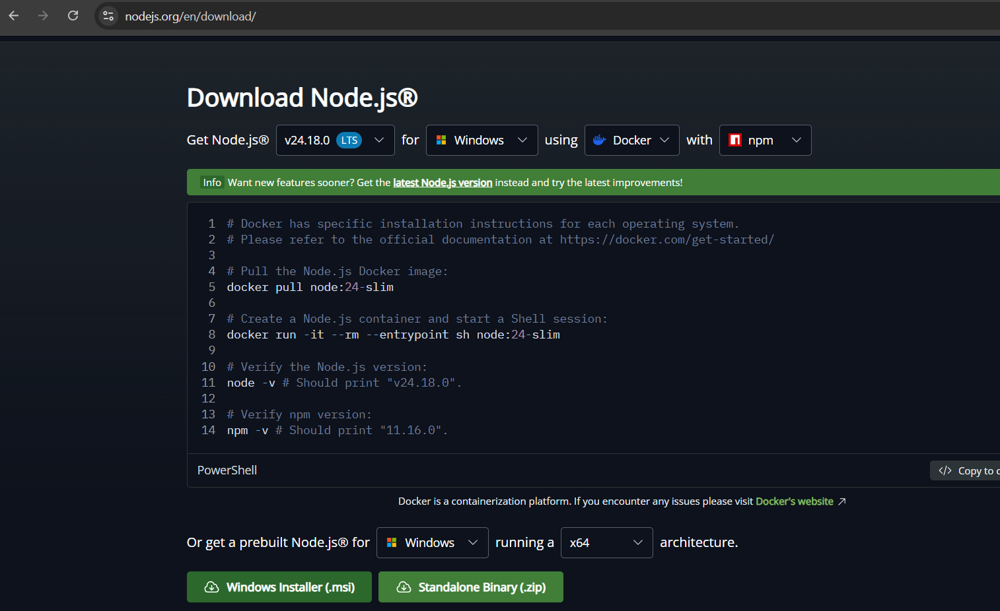

<div align=center><h1>setup anything :D</h1></div>

<details>
<summary><h1>setup laravel</h1></summary>

## install php (`Single Line Installer`) [link](https://www.php.net/downloads.php):



- go to this file to setup composer
```
C:\Users\<your-username>\AppData\Local\Programs\PHP\current\php.ini
```
- add these to the end of that file
```
extension=curl
extension=mbstring
extension=openssl
extension=fileinfo
extension=pdo_sqlite
```


## install composer (`Composer-Setup.exe`) [link](https://getcomposer.org/download):



## run command
```
composer global require laravel/installer
```

## install nodejs


## usage
create project:
```
laravel new my-app
php artisan migrate
```

</details>

<details>
<summary><h1>setup adb</h1></summary>

```
winget install Google.PlatformTools
```

</details>


<details>
<summary><h1>setup tailwind on react</h1></summary>

if ur using vite:

```bash
npm install tailwindcss @tailwindcss/vite
```

`vite.config.js`
```js
import { defineConfig } from 'vite'
import react from '@vitejs/plugin-react'
import tailwindcss from '@tailwindcss/vite'

export default defineConfig({
  plugins: [react(), tailwindcss()],
})
```

`src/index.css`:
```css
@import "tailwindcss";
```

</details>

<details>
<summary><h1>setup routes on react</h1></summary>

```bash
npm install react-router-dom
```

wrap your app with `<BrowserRouter>`
`main.jsx` (or `index.jsx`)
```jsx
import { StrictMode } from "react";
import { createRoot } from "react-dom/client";
import { BrowserRouter } from "react-router-dom";
import App from "./App";

createRoot(document.getElementById("root")).render(
  <StrictMode>
    <BrowserRouter>
      <App />
    </BrowserRouter>
  </StrictMode>
);
```

`App.jsx`
```jsx
import { Routes, Route } from "react-router-dom";
import Home from "./pages/Home";
import About from "./pages/About";

function App() {
  return (
    <Routes>
      <Route path="/" element={<Home />} />
      <Route path="/about" element={<About />} />
    </Routes>
  );
}

export default App;
```

navigate between them ex:
```jsx
import { Link } from "react-router-dom";

function Home() {
  return (
    <div>
      <h1>Home</h1>
      <Link to="/about"><button>Go to About</button></Link>
    </div>
  );
}
```

</details>

<details>
<summary><h1>setup login and register on react + laravel</h1></summary>

assuming u already setup axios and sanctum idk
## backend
- make sure app/Models/User.php has these:
```php
// app/Models/User.php
//...
use Laravel\Sanctum\HasApiTokens;
//...
class User extends Authenticatable
{
    use HasApiTokens, HasFactory, Notifiable;
    // ...
}
```
```
php artisan make:controller AuthController
```
```php
// app/Http/Controllers/AuthController.php
<?php

namespace App\Http\Controllers;

use Illuminate\Http\Request;
use Illuminate\Support\Facades\Hash;
use Illuminate\Validation\ValidationException;

class AuthController extends Controller
{
    public function register(Request $request){
        $request->validate([
            'name' => 'required|string|max:255',
            'email' => 'required|string|email|max:255|unique:users',
            'password' => 'required|string|min:8',
        ]);

        $user = User::create([
            'name' => $request->name,
            'email' => $request->email,
            'password' => Hash::make($request->password),
        ]);

        $token = $user->createToken('auth_token')->plainTextToken;

        return response()->json([
            'user' => $user,
            'token' => $token,
        ], 201);
    }

    public function login(Request $request){
        $request->validate([
            'email' => 'required|string|email',
            'password' => 'required|string',
        ]);

        $user = User::where('email', $request->email)->first();

        if (! $user || ! Hash::check($request->password, $user->password)) {
            throw ValidationException::withMessages([
                'email' => ['The provided credentials are incorrect.'],
            ]);
        }

        $token = $user->createToken('auth_token')->plainTextToken;

        return response()->json([
            'user' => $user,
            'token' => $token,
        ]);
    }

    public function logout(Request $request){
        $request->user()->currentAccessToken()->delete();

        return response()->json(['message' => 'Logged out'], 200);
    }

    public function user(Request $request){
        return response()->json($request->user());
    }
}
```
## frontend
```jsx
// src/api/axios.js
import axios from 'axios';

const api = axios.create({
  baseURL: 'http://localhost:8000/api',
  headers: {
    Accept: 'application/json',
  },
});

// Attach the token to every request automatically, once logged in
api.interceptors.request.use((config) => {
  const token = localStorage.getItem('token');
  if (token) {
    config.headers.Authorization = `Bearer ${token}`;
  }
  return config;
});

export default api;
```
```jsx
// src/pages/LoginRegister.jsx
import { useNavigate } from 'react-router-dom';
import api from '../api/axios';

export default function Login() {
    const navigate = useNavigate();

    const NAME = 'Levi Ackerman'
    const EMAIL = 'levi.ackerman@gmail.com'
    const PASSWORD = 'shinzousasageyo'

    const testLogin = () => {
        api
            .post("/login", {
                name: NAME,
                email: EMAIL,
                password: PASSWORD,
            })
            .then((res) => {
                localStorage.setItem('token', res.data.token);
                console.log(res.data)
                // navigate('/');
            })
            .catch((err) => console.error(err));
    }

    const testRegister = () => {
        api
            .post("/register", {
                name: NAME_MEMBER,
                email: EMAIL_MEMBER,
                password: PASSWORD_MEMBER,
            })
            .then((res) => {
                localStorage.setItem('token', res.data.token);
                console.log(res.data)
                // navigate('/');
            })
            .catch((err) => console.error(err));
    }

    const testLogout = () => {
        api
            .post("/logout")
            .then((res) => {
                localStorage.removeItem('token');
                console.log(res.data)
                navigate('/')
            })
            .catch((err) => console.error(err));
    }

    return (
        <div className='flex justify-center items-center h-screen flex-col gap-4'>
            <button onClick={testLogin}> test login as Member</button>
            <button onClick={testRegister}> test register as Member</button>
            <button onClick={testLogout}> test logout</button>
        </div>
    )
}
```


</details>

<details>
<summary><h1>deploy react to github</h1></summary>

on your react project:
```
npm install gh-pages --save-dev
```
at the top level of `package.json`:
```json
"homepage": "https://your-github-username.github.io/your-repo-name",
```
on the scripts section of `package.json`:
```json
"scripts": {
  // ... ur existing scripts
  "predeploy": "npm run build",
  "deploy": "gh-pages -d dist",
  // "deploy": "gh-pages -d build", // use this instead if ur not using vite
}
```
(skip this if ur not using vite) add this on `defineConfig()` function in `vite.config.js`:
```js
// ... code above
export default defineConfig({
  // ...
  base: '/your-repo-name/',
  // ...
})
```
deploy the app:
```
npm run deploy
```

</details>

<details>

<summary><h1>deploy react to firebase</h1></summary>

```
npm install -g firebase-tools
```
(u might want to restart ur terminal or ide first)
```
firebase login
```
```
npm run build
```
1. go to [firebase console](https://console.firebase.google.com/).
2. ensure ur signed in with the exact same Google account u used for `firebase login`.
click "get started by blah blah"

enter project name and proceed until its been created


<br><br>
do the stuffs above first before the code below<br>*i see u, u copy and paster >:D*
```
firebase init hosting
```
when it asks:
- select existing project
- set public directory to `dist` (or `build` if ur not using vite)
- configure as a single-page app: `yes`
- set up automatic builds with GitHub: `no` (unless u want that)
- file dist\index.html already exists. Overwrite? `no`
```
firebase deploy --only hosting
```
</details>

<details>

<summary><h1>deploy laravel to render</h1></summary>

create a file named `Dockerfile` on ur laravel (backend) folder, paste this:
```Dockerfile
FROM composer:2 AS vendor
WORKDIR /app
COPY . .
RUN composer install --no-dev --optimize-autoloader

FROM php:8.4-apache
RUN docker-php-ext-install pdo pdo_mysql
RUN a2enmod rewrite
COPY --from=vendor /app /var/www/html
WORKDIR /var/www/html
RUN sed -i 's/80/8080/g' /etc/apache2/ports.conf /etc/apache2/sites-enabled/000-default.conf \
 && sed -i 's#/var/www/html#/var/www/html/public#g' /etc/apache2/sites-enabled/000-default.conf \
 && chown -R www-data:www-data storage bootstrap/cache
EXPOSE 8080
```

commit and push it on ur repo.

go to [render.com](https://render.com/)

sign up with GitHub

find the `+ New` then `Web Service`.

find this `Credentials` button:


after clicking the thing:


then i recommend selecting `Only select repositories`


after that select ur repo.

- Region: closest to you `(Singapore)`
- Root Directory: if ur backend is on a subfolder specify it. <br>ex. `backend` (the Dockerfile should be in this folder)
- Language `Docker`


copy this line from your laravel (backend) folder's .env file
```env
APP_KEY=
```

go to the `Environment` tab and add it. <br>(just paste it on the `NAME_OF_VARIABLE` it will auto seperate it)

**Render's free Postgres only lasts 30 days then deletes your data.<br>
so lets use supabase because we are broke.**

so go to [supabase.com](https://supabase.com/) → sign up → New Organization

set a DB password, pick a region → create

click the green connect button thingy on top.


In Render → Environment tab → add:
```env
DB_CONNECTION=pgsql
DB_HOST=<from supabase>
DB_PORT=5432
DB_DATABASE=postgres
DB_USERNAME=<from supabase>
DB_PASSWORD=<from supabase>
```

connect the dots or something idk. im too lazy to write it.<br>
i recommend pasting the code above then edit all the `<from supabase>`.<br>
also the password is what u entered earlier.

</details>

<details>

<summary><h1>deploy laravel to google cloud</h1></summary>

```diff
- [!CAUTION]
- discontinued :>
- i dont have a credit card so i cant test
```

install [gcloud CLI](https://cloud.google.com/sdk/docs/install)

scroll down past the `Before You Begin`. ignore it for now.


a terminal will be opened. if not open a terminal then do `gcloud init`:


when it asks:
- sign in to continue? `yes`
- pick cloud project to use: create new one or if u deployed react project using firebase select same project

create a file named `Dockerfile` on ur laravel (backend) folder, paste this:
```Dockerfile
FROM composer:2 AS vendor
WORKDIR /app
COPY . .
RUN composer install --no-dev --optimize-autoloader

FROM php:8.3-apache
RUN docker-php-ext-install pdo pdo_mysql
RUN a2enmod rewrite
COPY --from=vendor /app /var/www/html
WORKDIR /var/www/html
RUN sed -i 's/80/8080/g' /etc/apache2/ports.conf /etc/apache2/sites-enabled/000-default.conf \
 && sed -i 's#/var/www/html#/var/www/html/public#g' /etc/apache2/sites-enabled/000-default.conf \
 && chown -R www-data:www-data storage bootstrap/cache
EXPOSE 8080
```

go to https://console.cloud.google.com/billing

(u can use google cloud for free. not free trial)

click `Add billing account`

to be continued...


<!--
run this (u might want to restart ur terminal or ide first):
```ps1
gcloud run deploy laravel-backend --source backend --region asia-southeast1 --allow-unauthenticated
```
-->

</details>

<details>
<summary><h1>generate android kotlin project</h1></summary>

super minimal, barebones kind of project

download [generate_android_project.py](https://github.com/IMOitself/setup-some-stuffs/blob/main/generate_android_project.py)

```bash
python generate_android_project.py --output MyApp --package com.example.myapp --name "My App"
```

u know what to edit in the command obviously.


</details>

<details>
<summary><h1>build android kotlin project</h1></summary>

install all tools without having to install a single program on ur computer

`cd` into the project folder, then run:

- run these 2 code snippets **ONCE**
```powershell
curl.exe -L -o gradle-9.7.0-bin.zip https://services.gradle.org/distributions/gradle-9.7.0-bin.zip
curl.exe -L -o jdk-21.0.12+8.zip https://github.com/adoptium/temurin21-binaries/releases/download/jdk-21.0.12%2B8/OpenJDK21U-jdk_x64_windows_hotspot_21.0.12_8.zip
curl.exe -L -o commandlinetools-win.zip https://dl.google.com/android/repository/commandlinetools-win-15859902_latest.zip

mkdir temp_build\gradle
mkdir temp_build\jdk
mkdir temp_build\android-sdk

tar -xf gradle-9.7.0-bin.zip -C temp_build\gradle
tar -xf jdk-21.0.12+8.zip -C temp_build\jdk
tar -xf commandlinetools-win.zip -C temp_build\android-sdk
```

```powershell
mkdir temp_build\android-sdk\cmdline-tools\latest
move temp_build\android-sdk\cmdline-tools\bin temp_build\android-sdk\cmdline-tools\latest\bin
move temp_build\android-sdk\cmdline-tools\lib temp_build\android-sdk\cmdline-tools\latest\lib
move temp_build\android-sdk\cmdline-tools\NOTICE.txt temp_build\android-sdk\cmdline-tools\latest\NOTICE.txt
move temp_build\android-sdk\cmdline-tools\source.properties temp_build\android-sdk\cmdline-tools\latest\source.properties
```

- run these 2 code snippets **whenever** ur gonna build the app
```powershell
$env:JAVA_HOME="$PWD\temp_build\jdk\jdk-21.0.12+8"
$env:ANDROID_HOME="$PWD\temp_build\android-sdk"

1..20 | ForEach-Object { "y" } | & "$PWD\temp_build\android-sdk\cmdline-tools\latest\bin\sdkmanager.bat" --licenses
& "$PWD\temp_build\android-sdk\cmdline-tools\latest\bin\sdkmanager.bat" "platform-tools" "platforms;android-37.0"
```
```powershell
& "$PWD\temp_build\gradle\gradle-9.7.0\bin\gradle.bat" assembleRelease
```

Use `assembleDebug` instead of `assembleRelease` for a debug build. Note that
`$env:JAVA_HOME` / `$env:ANDROID_HOME` only last for the current terminal
session — set them again (the two lines above) if you open a new terminal.

The built APK will be located at:
```
app\build\outputs\apk\release\app-release-unsigned.apk
app\build\outputs\apk\debug\app-debug.apk
```

## signing:
do this once:
```
keytool -genkeypair -v -keystore imo-tvbrowser-key.jks -keyalg RSA -keysize 2048 -validity 10000 -alias imo-tvbrowser-key
```
do this after u compiled the apk:
```powershell
.\temp_build\android-sdk\build-tools\36.0.0\apksigner.bat sign --ks <anything-idk>.jks --ks-key-alias <anything-idk> --out app-release-signed.apk ".\app\build\outputs\apk\release\app-release-unsigned.apk"
```

**WAIT**, change the `<anything-idk>` to whatever u want obviously

</details>
